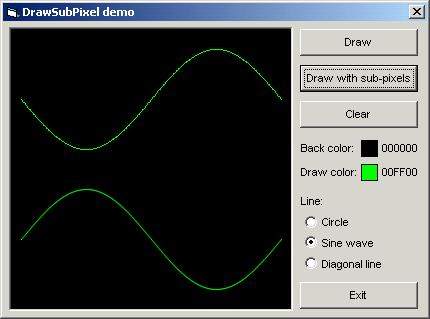



## sub\-pixel rendering example

### Description

this is just example of implementation sub-pixel rendering technique

described at:

http://www.eclipzer.com/tutorials/subpixel/subpixel.html

sub-pixel rendering tutorial is &#169; Quinton Roberts 2006.

enjoy =)
 
### More Info
 

             |
---                |---
**Submitted On**   |2006-10-19 18:00:02
**By**             |[Aleksandar Ruzicic](https://github.com/Planet-Source-Code/PSCIndex/blob/master/ByAuthor/aleksandar-ruzicic.md)
**Level**          |Beginner
**User Rating**    |5.0 (55 globes from 11 users)
**Compatibility**  |VB 5\.0, VB 6\.0
**Category**       |[Graphics](https://github.com/Planet-Source-Code/PSCIndex/blob/master/ByCategory/graphics__1-46.md)
**World**          |[Visual Basic](https://github.com/Planet-Source-Code/PSCIndex/blob/master/ByWorld/visual-basic.md)
**Archive File**   |[sub\-pixel\_20260610192006\.zip](https://github.com/Planet-Source-Code/aleksandar-ruzicic-sub-pixel-rendering-example__1-66836/archive/master.zip)

